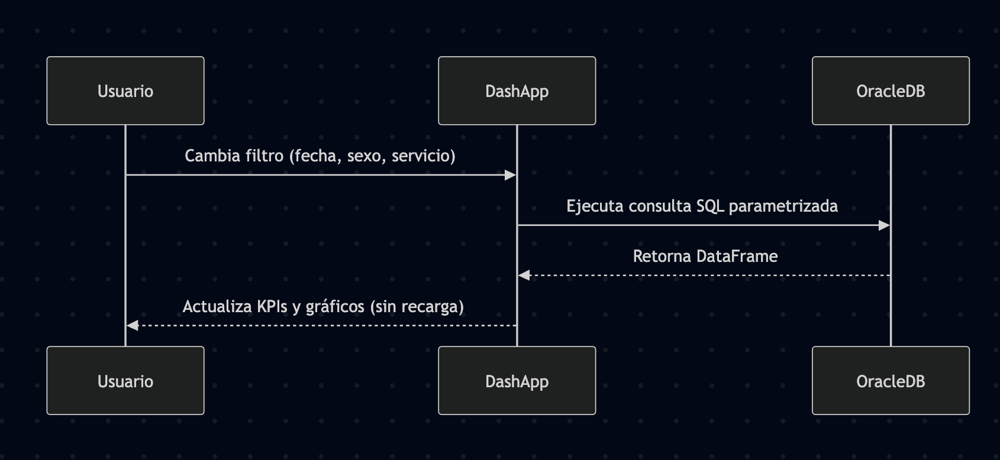

# 🧠 **Reporte Hito Avanzado - BHS: Architecture & Data**

## 🏅 **Premio BHS a la Comunicación e Integración de Funcionalidades**

**Proyecto:** *Malackathon Health Dashboard*  
**Equipo:** Cuarteto Alejandrino  
**Universidad de Málaga (UMA)**  
**Fecha:** 16 Octubre 2025

---

## 🧩 **1. Introducción**

El presente documento constituye el informe del **Hito Avanzado** correspondiente al *Premio BHS a la Comunicación e Integración de Funcionalidades*, en el marco del proyecto **Malackathon Health Dashboard**.  

El objetivo central del sistema es **analizar y visualizar datos clínicos de salud mental** provenientes de una base de datos Oracle Autonomous Database, mediante un dashboard multipágina interactivo desarrollado en **Dash (Python)**.  

Este reporte demuestra cómo se integran de manera limpia y modular las diferentes capas —Frontend (FE), Backend (BE) y Base de Datos (DB)— siguiendo principios de **Clean Architecture**, acompañadas de un proceso sólido de **preprocesamiento y análisis de datos (EDA)**, y un **dashboard dinámico e inteligente** que ofrece insights avanzados para la investigación clínica.

---

## 🏗️ **2. Clean Architecture**

### 🎯 **Objetivo**
Establecer una arquitectura modular y escalable que permita el **aislamiento de responsabilidades**, la **comunicación eficiente** entre componentes y la **integración fluida** de nuevas funcionalidades analíticas.

### 🧱 **Patrón Arquitectónico**

El sistema sigue un patrón **Multi-Page Application (MPA)** con enrutamiento del lado del cliente, renderizado en el servidor y callbacks reactivos.

```text
CLIENTE (Browser)
   │
   ▼
DASH SERVER (Flask)
   │
   ▼
ORACLE DATABASE
```

#### 🧩 **Separación de Capas**

| Capa | Responsabilidad | Archivos Clave |
|------|------------------|----------------|
| **Frontend (UI)** | Layouts, estilos y componentes visuales | `layouts/*.py`, `assets/custom.css` |
| **Lógica Reactiva** | Callbacks que gestionan interacciones y actualizaciones | `callbacks/*.py` |
| **Persistencia (DB)** | Consultas SQL parametrizadas y pooling de conexiones | `data/db_utils.py`, `config/db_config.py` |
| **Infraestructura** | Configuración, logging y despliegue | `utils/logger.py`, `systemd.service` |

### 📁 **Estructura de Directorios**

```text
malackathon/
├── app.py                  # Punto de entrada y enrutamiento
├── config/db_config.py     # Conexión Oracle y pooling
├── data/db_utils.py        # Consultas SQL centralizadas
├── layouts/                # Diseños de interfaz (landing, dashboard, análisis)
├── callbacks/              # Callbacks por módulo
├── assets/custom.css       # Estilos y animaciones
├── utils/logger.py         # Sistema de logging
└── certs/                  # Wallet y certificados SSL
```

### 🔄 **Flujo de Comunicación**

### ⚙️ **Funcionamiento Interno**

1. El usuario modifica un filtro en la interfaz.  
2. El callback correspondiente se activa (`load_overview_data`).  
3. Se ejecutan consultas SQL seguras y parametrizadas hacia Oracle.  
4. Los resultados son procesados con Pandas y almacenados en `dcc.Store`.  
5. Los gráficos y KPIs se actualizan dinámicamente con Plotly.

### 🔒 **Seguridad y Despliegue**
- Autenticación mediante **Oracle Wallet**.
- Variables de entorno para credenciales.
- Comunicación **HTTPS** con certificados SSL/TLS.
- Despliegue en producción con **Gunicorn + Systemd**, garantizando reinicio automático.

### 🚀 **Rendimiento y Escalabilidad**
- Uso de **connection pooling** para reducir la latencia.
- Lazy loading de gráficos y almacenamiento local (`dcc.Store`).
- Estructura preparada para escalado horizontal (workers Gunicorn).

---

## 📊 **3. Data Analysis (EDA)**

### 🎯 **Objetivo del Análisis**
Comprender la estructura, calidad y relaciones en la información clínica antes del modelado y visualización, garantizando datos **fiables, limpios y consistentes**.

### 🧹 **1. Prelimpieza de Datos**
Se estandarizaron los formatos de fechas y horas para asegurar compatibilidad con Oracle.  
Los valores “ZZZ” en campos numéricos fueron reemplazados por `999`, preservando la integridad tipológica y evitando errores en importación.

### 🔐 **2. Proceso de Anonimización**
Aplicación del algoritmo **SHA-256** sobre la columna `Nombre`, eliminando toda posibilidad de reversibilidad y manteniendo unicidad de registros.

### 🧺 **3. Limpieza de Columnas Nulas**
Se eliminaron campos sin valor analítico:
- `CCAA_RESIDENCIA`, `GDR_AP`, `PROCEDIMIENTO_EXTERNO_4–6`, `TIPO_PROCESO_IR`, `VALOR_PESO_ESPAÑOL`, entre otros.

### 🧮 **4. Normalización de la Estructura**

#### **Esquema Final Relacional**

| Tabla | Descripción |
|--------|--------------|
| **PACIENTE** | Datos demográficos y residencia |
| **INGRESO** | Información hospitalaria y costes |
| **DIAGNOSTICOS_INGRESO** | Diagnósticos múltiples por ingreso |
| **SIGNIFICADO_DIAGNOSTICO** | Diccionario CIE-10 |

Eliminación de redundancias: `MES_DE_INGRESO` derivado de `FECHA_DE_INGRESO`, `EDAD` reemplazada por `EDAD_EN_INGRESO`.

### ✅ **5. Resultado Final**
- **Calidad:** Formatos y valores coherentes.  
- **Confidencialidad:** Hashing irreversible.  
- **Eficiencia:** Estructura optimizada y sin duplicados.  
- **Consistencia:** Preparada para análisis predictivo y BI.

---

## 📈 **4. Data Visualization**

### 🎯 **Objetivo**
Mostrar información de manera **intuitiva, dinámica y coherente** con la naturaleza estadística de los datos clínicos.

### 🧭 **Estructura Visual del Dashboard**

- **Landing Page:** Hero section animada, tarjetas de características y CTA.
- **Dashboard Principal:** KPIs, histogramas, líneas temporales, gráficas de distribución y barras comparativas.
- **Módulos Avanzados:** Cohort Analysis, Clinical Insights y Predictive Analytics.

### 🧩 **Componentes Principales**

| Tipo | Descripción |
|------|--------------|
| KPI Cards | Indicadores clave: pacientes, ingresos, costes |
| Pie Chart | Distribución por sexo |
| Histogram | Distribución por edad |
| Line Chart | Evolución mensual de ingresos |
| Bar Chart | Diagnósticos, servicios, comunidades |

### ⚡ **Interactividad y Filtros**
- Rango de fechas, sexo, comunidad, servicio.
- Callbacks reactivos (`@callback`) con actualización automática.
- `dcc.Store` para caching y comunicación entre componentes.

### 📱 **Diseño Responsive**
Implementación de sistema de rejilla Bootstrap con breakpoints `xl/lg/md/sm/xs`, asegurando usabilidad en móviles y pantallas reducidas.

---

## 🔬 **5. Advanced Analysis Modules**

Los módulos avanzados amplían el análisis descriptivo hacia una analítica inferencial, apoyándose en consultas SQL optimizadas y visualizaciones complejas.

### 👥 **Cohort Analysis**
- **Objetivo:** Detectar patrones de reingreso y trayectorias de pacientes.
- **Métricas:** Tasa de reingreso, días promedio entre ingresos, distribución de cohortes.
- **Visualizaciones:** Scatter plot (coste vs. ingresos), pie chart (reingreso/no), barras de comorbilidad.
- **Filtros:** Fecha, umbral de reingreso (7–90 días), mínimo de ingresos.

### 🏥 **Clinical Insights**
- **Objetivo:** Comprender relaciones clínicas y gravedad.
- **Consultas:** Agrupación por severidad y riesgo APR.
- **Visualizaciones:** Triple panel (pacientes, coste, estancia), box plot de duración, correlaciones de diagnóstico.
- **Uso:** Evaluación de comorbilidad y riesgo clínico.

---

## 🧠 **6. Evaluación según criterios BHS**

| Categoría | Indicadores Clave | Nivel | Evidencia |
|------------|------------------|--------|------------|
| **Clean Architecture** | Separación FE–BE–DB, modularidad, callbacks, conexión segura | ✅✅✅ | Arquitectura documentada y funcional |
| **Data Analysis** | EDA completo, anonimización, normalización | ✅✅✅ | Documento `data_analysis.pdf` |
| **Data Visualization** | Dashboard dinámico, filtros, gráficos actualizados | ✅✅✅ | Módulos de análisis avanzados |
| **Integración** | Comunicación fluida entre capas | ✅✅✅ | Callbacks ↔ SQL ↔ Gráficos |

---

## 🧾 **7. Conclusiones**

El proyecto **Malackathon Health Dashboard** representa una integración sólida entre ingeniería de software, análisis de datos y visualización avanzada.

- Se implementó una **arquitectura limpia y mantenible** basada en módulos independientes.  
- Se realizaron **procesos de preprocesamiento y normalización** conforme a las mejores prácticas de EDA.  
- Se construyó un **dashboard dinámico y científico**, con visualizaciones reactivas y diseño responsivo.  
- Se añadieron **módulos avanzados de análisis clínico y predictivo**, fortaleciendo la capacidad analítica del sistema.  

El resultado cumple plenamente con los principios del **Premio BHS**, al demostrar comunicación efectiva entre funcionalidades, código limpio y análisis de datos de alta calidad.

---

**Malackathon Málaga 2025 – Dashboard de Salud Mental**  
*Automatización eficiente, arquitectura limpia y comunicación entre sistemas.*

