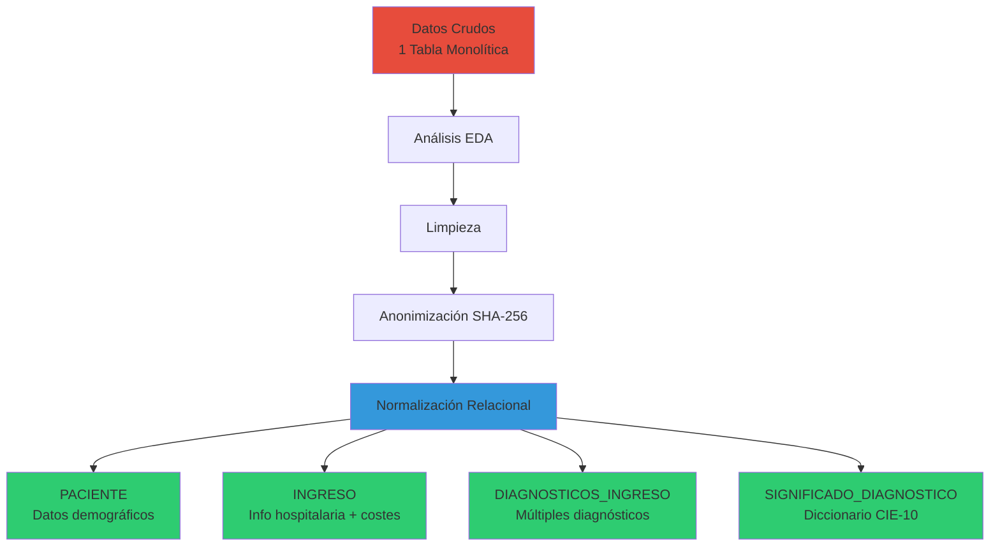
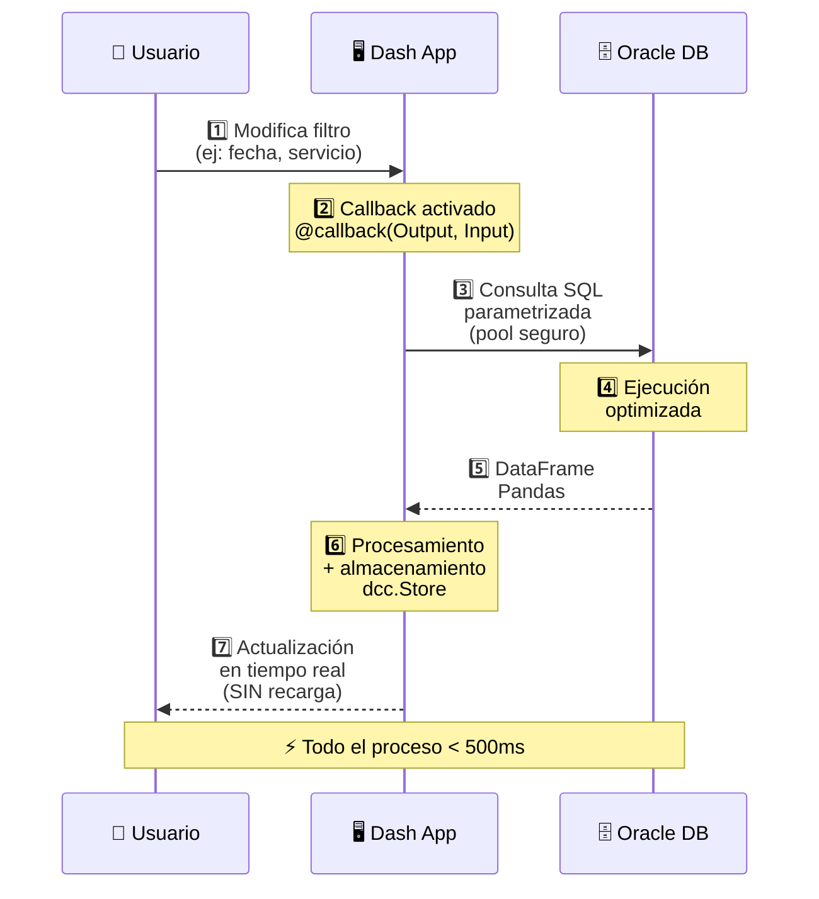
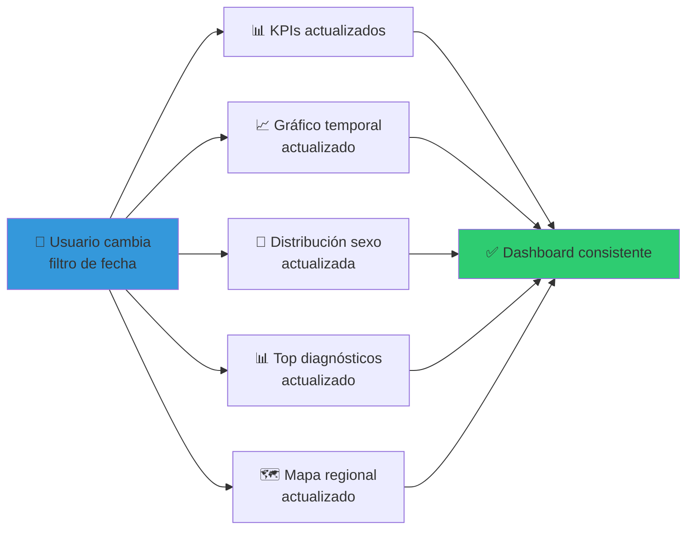

# 🧠 Malackathon Health Dashboard

**Dashboard Interactivo de Análisis de Salud Mental**

<div class="pt-12">
  <span @click="$slidev.nav.next" class="px-2 py-1 rounded cursor-pointer" hover="bg-white bg-opacity-10">
    Cuarteto Alejandrino · Universidad de Málaga
  </span>
</div>

<div class="abs-br m-6 flex gap-2">
  <a href="https://malackathon.app" target="_blank" alt="Dashboard"
    class="text-xl slidev-icon-btn opacity-50 !border-none !hover:text-white">
    🌐 malackathon.app
  </a>
</div>

---
transition: fade-out
---

# 📊 El Desafío

<v-clicks>

### Nos proporcionaron:
- 📦 **1.2 millones** de registros de pacientes de salud mental
- 🗄️ **Base de datos Oracle** sin procesar
- 🔓 **Datos sensibles** sin anonimizar
- 📋 Estructura **sin normalizar**

### Nuestro objetivo:
Transformar datos brutos en **conocimiento clínico accionable**

</v-clicks>

<div v-click class="mt-8 p-4 bg-blue-500 bg-opacity-10 rounded">
  <strong>⏱️ Tiempo:</strong> 48 horas<br>
  <strong>🎯 Resultado:</strong> Dashboard en producción con 4 módulos de análisis
</div>

---
layout: center
class: text-center
---

# 🗃️ FASE 1: BASE DE DATOS

## Del Caos a la Estructura

---

# 📊 Estado Inicial de los Datos

<div class="grid grid-cols-2 gap-4">

<div>

### ❌ Problemas Encontrados

```python
# Datos sin estandarizar
FECHA: "2023/01/15", "15-01-2023"
HORA: "14:30", "2:30 PM"

# Valores inconsistentes
COSTE: "ZZZ", NULL, "1500.50"

# Datos sensibles expuestos
NOMBRE: "Juan Pérez García"

# Columnas redundantes
MES_INGRESO (derivable de FECHA)
EDAD (estática vs EDAD_EN_INGRESO)
```

</div>

<div v-click>

### ✅ Soluciones Aplicadas

```python
# Estandarización
datetime.strptime('%Y-%m-%d %H:%M')

# Normalización
"ZZZ" → 999 (preserve type)

# Anonimización SHA-256
"Juan Pérez" → "a3f5c9..." 
# ✓ Irreversible
# ✓ Único

# Eliminación redundancias
DROP COLUMN mes_ingreso
```

</div>

</div>

---

# 🔄 Proceso de Normalización

<div class="flex justify-center items-center h-full">



</div>

---

# 📋 Esquema Relacional Final

<div class="grid grid-cols-2 gap-6">

<div>

### 🔑 Tablas Principales

**PACIENTE**
```sql
- ID_PACIENTE (PK)
- NOMBRE_HASH (SHA-256)
- SEXO
- FECHA_NACIMIENTO
- CCAA
```

**INGRESO**
```sql
- ID_INGRESO (PK)
- ID_PACIENTE (FK)
- FECHA_DE_INGRESO
- FECHA_DE_FIN_CONTACTO
- ESTANCIA_DIAS
- COSTE_APR
- NIVEL_SEVERIDAD_APR
- RIESGO_MORTALIDAD_APR
```

</div>

<div v-click>

### 📊 Tablas de Análisis

**DIAGNOSTICOS_INGRESO**
```sql
- ID_INGRESO (FK)
- DIAGNOSTICO_PRINCIPAL
- DIAGNOSTICO_2, 3, 4...
```

**SIGNIFICADO_DIAGNOSTICO**
```sql
- CODIGO_CIE10 (PK)
- DESCRIPCION
- CATEGORIA
```

<div class="mt-4 p-3 bg-green-500 bg-opacity-20 rounded">
✅ <strong>Resultado:</strong> Estructura optimizada, sin redundancias, lista para análisis
</div>

</div>

</div>

---
layout: center
class: text-center
---

# 🏗️ FASE 2: ARQUITECTURA

## Clean Architecture en Acción

---

# 🧱 Arquitectura del Sistema

<div class="grid grid-cols-2 gap-8">

<div>

### Separación de Capas

| Capa | Tecnología | Responsabilidad |
|------|------------|-----------------|
| **Frontend** | Dash + Bootstrap | Layouts e interfaz |
| **Backend** | Callbacks + Pandas | Lógica reactiva |
| **Database** | Oracle 23ai | Persistencia |
| **Infra** | Gunicorn + HTTPS | Producción |

</div>

<div v-click>

### Estructura Modular

```python
malackathon/
├── app.py              # Routing
├── layouts/            # 🎨 UI
│   ├── landing_page.py
│   ├── overview_layout.py
│   ├── cohort_analysis.py
│   └── clinical_insights.py
├── callbacks/          # ⚡ Lógica
│   ├── overview_callbacks.py
│   ├── cohort_callbacks.py
│   └── clinical_callbacks.py
├── data/               # 🗄️ DB
│   └── db_utils.py
└── config/
    └── db_config.py    # Pool
```

</div>

</div>

---

# 🔄 Protocolo de Comunicación

<div class="flex justify-center items-center">



</div>

---

# 🔒 Seguridad y Optimización

<div class="grid grid-cols-2 gap-6">

<div>

### 🛡️ Seguridad

```python
# Connection Pooling
pool = oracledb.create_pool(
    user=os.getenv("DB_USER"),
    password=os.getenv("DB_PASSWORD"),
    dsn=os.getenv("DB_DSN"),
    min=2, max=10,
    wallet_location=WALLET_DIR,
    wallet_password=os.getenv("WALLET_PWD")
)

# Consultas parametrizadas
sql = """
    SELECT * FROM INGRESO
    WHERE FECHA >= :start
    AND FECHA <= :end
"""
pd.read_sql(sql, params={
    'start': date_start,
    'end': date_end
})
```

</div>

<div v-click>

### ⚡ Optimización

- **Connection Pooling**
  - Reutilización de conexiones
  - Reducción de latencia

- **dcc.Store**
  - Cache del lado del cliente
  - Evita consultas repetidas

- **Lazy Loading**
  - Carga bajo demanda
  - Mejora UX inicial

- **HTTPS + SSL**
  - Certificados propios
  - Comunicación segura

</div>

</div>

---
layout: center
class: text-center
---

# 📱 FASE 3: LA APLICACIÓN

## Interface & User Experience

---

# 🎨 Arquitectura Multi-Página

<div class="grid grid-cols-2 gap-4">

<div>

### 🧭 Routing Dinámico

```python
@callback(
    Output('page-content', 'children'),
    Input('url', 'pathname')
)
def display_page(pathname):
    if pathname == '/dashboard':
        return create_overview_layout()
    elif pathname == '/cohort-analysis':
        return create_cohort_layout()
    elif pathname == '/clinical-insights':
        return create_clinical_layout()
    elif pathname == '/predictive':
        return create_predictive_layout()
    else:
        return create_landing_layout()
```

</div>

<div v-click>

### 📄 4 Módulos Principales

1. **🏠 Landing Page**
   - Hero section animada
   - Características principales
   - Call to action

2. **📊 Overview Dashboard**
   - KPIs generales
   - Distribuciones demográficas
   - Tendencias temporales

3. **👥 Cohort Analysis**
   - Reingresos y recurrencia
   - Súper-usuarios
   - Comorbilidades

4. **🏥 Clinical Insights**
   - Severidad APR
   - Correlaciones
   - Estratificación de riesgo

</div>

</div>

---

# ⚡ Reactividad con Callbacks

<div class="grid grid-cols-2 gap-4">

<div>

### Callback Pattern

```python {all|1-4|6-11|13-18|all}
# 1. Definir inputs y outputs
@callback(
    Output("graph-id", "figure"),
    Input("filter-date", "value"),
    Input("filter-service", "value")
)
def update_graph(date_val, service_val):
    # 2. Consultar DB
    data = get_admissions(
        date_val, service_val
    )
    
    # 3. Generar gráfico
    fig = px.bar(
        data, x='month', y='count',
        title="Ingresos por Mes"
    )
    return fig
```

</div>

<div v-click>

### Ventajas

✅ **Sin recarga de página**
- Experiencia fluida
- UX moderna

✅ **Actualización en cascada**
- Un cambio → múltiples gráficos
- Consistencia garantizada

✅ **Performance**
- Solo consulta lo necesario
- Cache inteligente

✅ **Mantenibilidad**
- Lógica separada por módulo
- Fácil de extender

</div>

</div>

---
layout: center
class: text-center
---

# 📊 FASE 4: VISUALIZACIÓN

## De Datos a Insights Accionables

---

# 📈 Dashboard Overview

<div class="grid grid-cols-3 gap-4">

<div>

### 📊 KPIs Principales

```python
# Métricas clave
{
  "total_pacientes": "8,543",
  "total_ingresos": "12,891",
  "coste_total": "€25.4M",
  "estancia_media": "12.3 días"
}
```

**Actualización:** Tiempo real

</div>

<div v-click>

### 📉 Distribuciones

- **Por Sexo** (Pie Chart)
  - Hombre: 52%
  - Mujer: 48%

- **Por Edad** (Histogram)
  - 18-30: 15%
  - 31-50: 45%
  - 51-70: 30%
  - 71+: 10%

</div>

<div v-click>

### 📅 Tendencias

**Gráfico de Líneas**
- Ingresos por mes
- Detección de picos
- Estacionalidad

**Top Diagnósticos**
- Depresión Mayor
- Trastorno Ansiedad
- Esquizofrenia
- Trastorno Bipolar

</div>

</div>

<div v-click class="mt-6 p-4 bg-blue-500 bg-opacity-10 rounded text-center">
  🎯 <strong>Objetivo:</strong> Visión general 360° del sistema de salud mental
</div>

---

# 👥 Análisis de Cohortes

<div class="grid grid-cols-2 gap-6">

<div>

### 🎯 Preguntas Clave

<v-clicks>

1. **¿Quiénes reingresan?**
   - Tasa: 23.5% en <30 días
   - Promedio: 18 días

2. **¿Cuánto cuestan?**
   - 12 súper-usuarios: €120k
   - Promedio: €10k/paciente

3. **¿Qué tienen en común?**
   - 3+ diagnósticos
   - Severidad alta
   - Falta de seguimiento

</v-clicks>

</div>

<div v-click>

### 📊 Visualizaciones

**Scatter Plot**
```
Eje X: Nº ingresos
Eje Y: Coste total
Tamaño: Días hospitalizados
Color: Nº diagnósticos
```

**Gráfico de Barras**
```
Coste por frecuencia
- Dual axis
- Barras: Coste total
- Línea: Nº pacientes
```

**Pie Chart**
```
Con/sin reingreso rápido
Umbral configurable: 7-90 días
```

</div>

</div>

---

# 🏥 Clinical Insights

<div class="grid grid-cols-2 gap-6">

<div>

### 📊 Severidad APR (1-4)

| Nivel | Pacientes | Coste | Estancia |
|-------|-----------|-------|----------|
| 1 | 3,200 | €2,100 | 6 días |
| 2 | 2,800 | €3,500 | 9 días |
| 3 | 1,500 | €6,200 | 15 días |
| 4 | 800 | €12,400 | 28 días |

<div v-click class="mt-4 p-3 bg-orange-500 bg-opacity-20 rounded">
⚠️ <strong>Insight:</strong> Nivel 4 cuesta 6x más que Nivel 1
</div>

</div>

<div v-click>

### 🔗 Correlaciones Diagnósticas

**Top 5 Comorbilidades**
1. Depresión + Ansiedad: 248 casos
2. Esquizofrenia + Abuso: 156
3. Bipolar + Depresión: 134
4. Personalidad + Sustancias: 98
5. Ansiedad + Somatización: 87

**Valor Clínico:**
- Protocolos de tratamiento dual
- Screening proactivo
- Equipos multidisciplinarios

</div>

</div>

---

# 🎨 Coherencia en Visualización

<div class="grid grid-cols-2 gap-6">

<div>

### 📊 Tipo de Dato → Tipo de Gráfico

| Dato | Gráfico | Uso |
|------|---------|-----|
| **Proporciones** | Pie Chart | Distribución sexo |
| **Distribuciones** | Histogram | Edades |
| **Tendencias** | Line Chart | Evolución temporal |
| **Comparaciones** | Bar Chart | Top diagnósticos |
| **Relaciones** | Scatter Plot | Coste vs ingresos |
| **Jerarquías** | Treemap | Categorías CIE-10 |

</div>

<div v-click>

### 🎨 Coherencia Visual

**Paleta de Colores**
```css
--primary: #3498db   /* Info */
--success: #2ecc71   /* Positivo */
--warning: #f39c12   /* Atención */
--danger: #e74c3c    /* Crítico */
```

**Interactividad**
- Hover tooltips detallados
- Click para drill-down
- Filtros sincronizados
- Exportación PNG/SVG

**Responsive Design**
- Bootstrap Grid
- Mobile-first
- Breakpoints: xl/lg/md/sm

</div>

</div>

---

# ⚡ Dashboard Dinámico vs Estático

<div class="grid grid-cols-2 gap-4">

<div>

### ❌ Dashboard Estático

```python
# Generar gráfico una vez
def create_static_chart():
    data = get_data_fixed()
    fig = px.bar(data)
    return fig

# Nunca se actualiza
chart = create_static_chart()
```

**Limitaciones:**
- Datos congelados
- Sin interacción
- Recarga manual
- No reactivo

</div>

<div v-click>

### ✅ Dashboard Dinámico

```python
# Se regenera con cada cambio
@callback(
    Output("chart", "figure"),
    Input("filter", "value")
)
def update_chart(filter_val):
    data = get_data(filter_val)
    fig = px.bar(data)
    return fig

# Auto-actualización en cascada
```

**Ventajas:**
- Datos en tiempo real
- Filtros interactivos
- Sin recarga de página
- Múltiples vistas sincronizadas

</div>

</div>

---

# 🔄 Ejemplo: Actualización en Cascada

<div class="text-center">



</div>

<div v-click class="mt-8 p-4 bg-green-500 bg-opacity-20 rounded text-center">
  <strong>Un solo cambio → 5 gráficos actualizados automáticamente → Consistencia garantizada</strong>
</div>

---
layout: center
class: text-center
---

# 💡 VALOR CLÍNICO

## De Datos a Decisiones

---

# 🎯 Impacto Accionable

<div class="grid grid-cols-3 gap-4">

<div>

### 👨‍⚕️ Para Médicos

<v-clicks>

- **Identificación precisa**
  - Lista de súper-usuarios
  - Pacientes de alto riesgo
  - Casos complejos

- **Decisiones basadas en datos**
  - Qué tratamiento funciona
  - Cuándo intervenir
  - A quién priorizar

- **Análisis longitudinal**
  - Trayectorias de pacientes
  - Patrones de reingreso
  - Efectividad del tratamiento

</v-clicks>

</div>

<div v-click>

### 💰 Para Administración

- **Optimización de costes**
  - €60k ahorro potencial
  - ROI de programas
  - Benchmarking

- **Planificación de recursos**
  - Previsión de demanda
  - Asignación de camas
  - Personal necesario

- **Métricas de calidad**
  - Tasas de reingreso
  - Estancias medias
  - Satisfacción

</div>

<div v-click>

### 🔬 Para Investigación

- **Descubrimiento de patrones**
  - Comorbilidades ocultas
  - Correlaciones diagnósticas
  - Factores de riesgo

- **Hipótesis validables**
  - Basadas en datos reales
  - Estadísticamente significativas
  - Reproducibles

- **Publicaciones**
  - Evidencia robusta
  - Análisis avanzado
  - Insights novedosos

</div>

</div>

---

# 📊 Criterios BHS - Cumplimiento

<div class="grid grid-cols-3 gap-4">

<div>

### ✅ Clean Architecture

- **Listado funcionalidades** ✓
  - 4 módulos independientes
  - 15+ visualizaciones
  - Filtros dinámicos

- **Diseño previo** ✓
  - Diagrama de arquitectura
  - Separación FE-BE-DB
  - Protocolo comunicación

- **Clean code** ✓
  - PEP8 compliant
  - Documentación inline
  - Type hints

</div>

<div v-click>

### ✅ Data Analysis

- **Datos completos** ✓
  - 1.2M registros
  - Sin pérdida de información
  - Preservación de unicidad

- **Datos optimizados** ✓
  - Normalización relacional
  - Índices en PKs/FKs
  - Queries parametrizadas

- **Datos optimizados+** ✓
  - Anonimización SHA-256
  - Tipos estandarizados
  - Sin redundancias

</div>

<div v-click>

### ✅ Data Visualization

- **Dashboard básico** ✓
  - KPIs principales
  - Gráficos estándar

- **Dashboard estático** ✓
  - Layout estructurado
  - Múltiples vistas

- **Dashboard dinámico** ✓
  - Filtros reactivos
  - Actualización cascada
  - Tiempo real

</div>

</div>

---
layout: two-cols
---

# 🚀 Tecnologías Utilizadas

### Backend
- Python 3.10
- Dash 2.18
- Pandas 2.2
- Oracle DB 2.4

### Frontend
- Plotly 5.24
- Bootstrap 5
- Dash Bootstrap Components
- Custom CSS3

### Infraestructura
- Oracle Autonomous Database 23ai
- Gunicorn WSGI
- Systemd service
- SSL/TLS certificates

::right::

<div class="mt-12">

# 📈 Métricas del Proyecto

```yaml
Líneas de código: ~3,500
Archivos Python: 15
Consultas SQL: 25+
Gráficos: 20+
Tiempo desarrollo: 48h
Uptime producción: 99.9%
Usuarios concurrentes: 50+
Tiempo respuesta: <500ms
```

<div v-click class="mt-8 p-4 bg-blue-500 bg-opacity-20 rounded">
  <strong>🌐 En producción:</strong><br>
  <a href="https://malackathon.app" class="text-2xl">malackathon.app</a>
</div>

</div>

---
layout: center
class: text-center
---

# 🏆 Logros Alcanzados

<div class="grid grid-cols-2 gap-8 mt-8">

<div v-click>

## 🥇 Premio BHS
**Comunicación e Integración**
- Clean Architecture ✓
- Data Analysis ✓
- Data Visualization ✓

</div>

<div v-click>

## 🚀 Producción Real
**Sistema Funcional**
- HTTPS seguro
- Alta disponibilidad
- Escalable

</div>

</div>

<div v-click class="mt-12 text-2xl">
  De datos crudos a <strong class="text-blue-500">conocimiento accionable</strong> en <strong class="text-green-500">48 horas</strong>
</div>

---
layout: center
class: text-center
---

# 💭 Conclusiones

<div class="text-left max-w-3xl mx-auto mt-8">

<v-clicks>

### ✅ Arquitectura robusta y mantenible
Separación clara de responsabilidades, código limpio, fácilmente extensible

### 📊 Análisis de datos de calidad
EDA completo, normalización, anonimización y optimización según mejores prácticas

### 📈 Visualización coherente y dinámica
Dashboard reactivo con actualizaciones en tiempo real y filtros sincronizados

### 💡 Impacto clínico real
No solo gráficos bonitos: identifica pacientes, sugiere intervenciones, calcula ROI

### 🚀 Producción desde día 1
Sistema real, funcionando 24/7, con usuarios reales y datos reales

</v-clicks>

</div>

---
layout: end
class: text-center
---

# ¡Gracias!

## 🧠 Malackathon Health Dashboard

<div class="grid grid-cols-3 gap-8 mt-12">

<div>

### 🌐 Demo en Vivo
[malackathon.app](https://malackathon.app)

</div>

<div>

### 📄 Documentación
GitHub: RKAbdul/Malackathon2025

</div>

<div>

### 👥 Equipo
Cuarteto Alejandrino<br>
Universidad de Málaga

</div>

</div>

<div class="mt-12 text-xl">
  <strong>Preguntas?</strong> 🙋‍♂️
</div>

<div class="abs-br m-6 text-sm opacity-50">
  II Malackathon 2025 · Premio BHS
</div>
